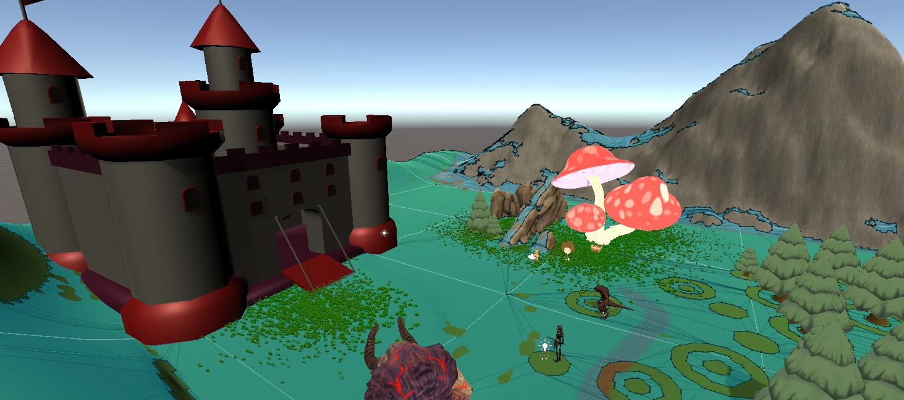
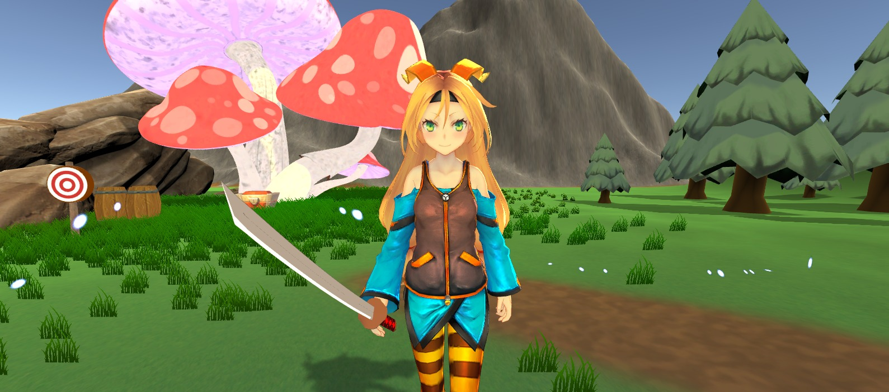
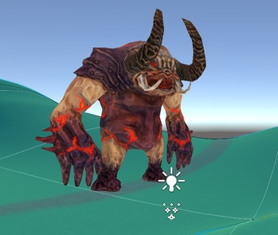
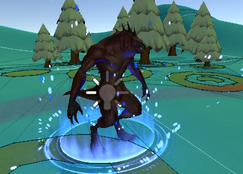

# 🏰 Castle Defender  

## 🎮 Descrição do Jogo e Controles  

**Castle Defender** é um jogo desenvolvido na **Unity**, ambientado em uma **ilha mágica** onde o jogador assume o papel de uma **guerreira lendária** encarregada de **proteger o castelo do rei** contra hordas de monstros que surgem de portais misteriosos.  

Seu objetivo é **derrotar todos os inimigos** e **impedir que o castelo seja destruído**, sobrevivendo o máximo possível.  

**Controles:**  
- **W / S / A / D** → Movimentação da guerreira  
- **Mouse** → Controle da câmera e direção dos ataques  
- **Botão esquerdo do mouse** → Ataque com a espada mágica  
- **Espaço (Space)** → Pular  
- **Esc** → Menu principal  

---

## 📖 História do Jogo  

Em uma ilha mágica cercada por mistérios e forças antigas, repousa o **Castelo do Rei**, um símbolo de paz e poder.  
Mas em um dia sombrio, **portais se abriram no coração da ilha**, liberando **golens**, **esqueletos** e **lagartos gigantes** — criaturas que buscam destruir o castelo e dominar o reino.  

Para deter essa ameaça, o rei convocou sua **guerreira mais poderosa**, portadora de uma **espada encantada**, capaz de canalizar a energia mágica da própria ilha.  

Agora, cabe a você **defender o castelo**, **enfrentar as ondas de monstros** e **impedir que o reino caia nas trevas**.  

---

## 🕹️ Gameplay  

Confira abaixo o vídeo de demonstração do jogo em execução:  

  

---

## 📸 Prints do Jogo  

### 🏝️🏰 Ilha Mágica e o Castelo do Rei
  

### ⚔️ Guerreira  
  

## 👾 Inimigos  

| 🪨 **Golem** | 💀 **Esqueleto** | 🦎 **Lagarto Gigante** |
|:-------------:|:----------------:|:----------------------:|
|  |  |  |

---

## 📬 Contato  

👤 **Caio Taveira**